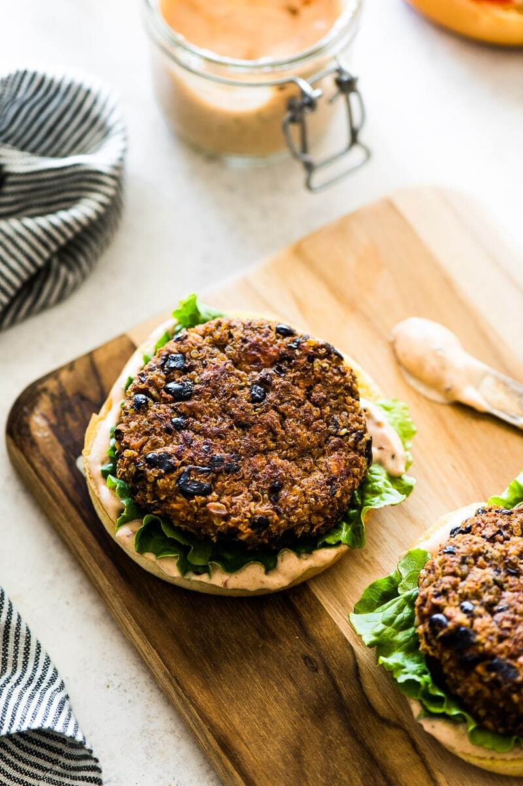

Red quinoa and black bean burgers. Freeze and save for later!

|Prep time|Total time|
--- | ---
|15mm|25m|

## Ingredients

|Ingredient|Quantity|
--- | ---
black beans | 14 oz
red quinoa | 1 cup
breadcrumbs (sub ground oats) | 1 cup
onion powder | 1 tsp.
tomato paste | 6 oz
garlic cloves, roughly chopped | 3 cloves
soy sauce | 1 Tbsp.
salt | 1/2 tsp.
cumin | 1 tsp.
chili powder | 1 tsp.
paprika | 1 tsp.
black pepper | 1/2 tsp.
shezuan chili oil | 1 tsp.
olive oil | 2 Tbsp.
Buns | ~12

## Directions

1. First, cook your quinoa if you haven't. Rinse your beans, then mash them in a large mixing bowl. After that add the cooked quinoa. Mix all the rest of the ingredients together in a mixing bowl by hand. 
1. Using your hand, form the mixture into ~12 patties, placing them onto a plate.
1. At this point, get out a large skillet and set the temp to med-high. Fry them on both sides evenly till they are slightly browned. (Around 2-4 min per side).
1. Serve on a bun with your favourite burger condiments!

Source: 
