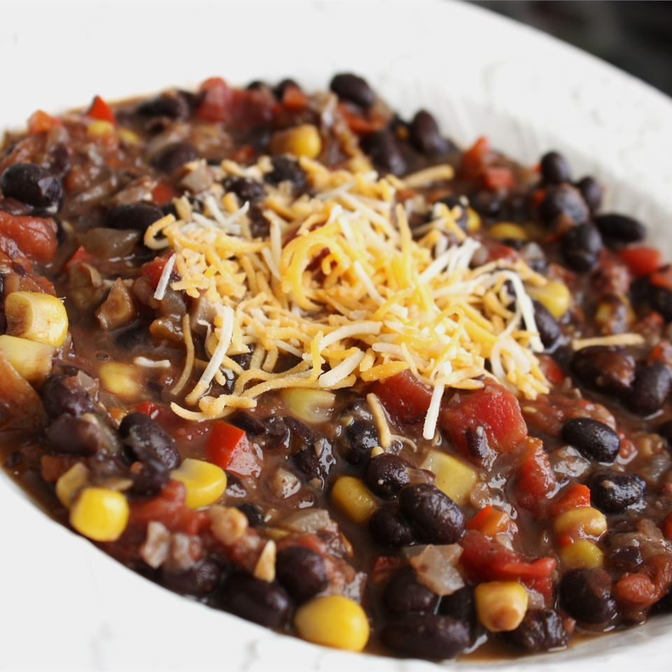

A chili that is best when prepared with fresh vegetables, but still delicious with canned or frozen. Serve by itself or over rice.

|Prep time|Total time|
--- | ---
|20m|40m|

## Ingredients

|Ingredient|Quantity|
--- | ---
olive oil|1 Tbsp. 
onion, chopped|1
red bell pepper, seeded and chopped|2
jalapeno pepper, seeded and minced|2
roma (plum) tomatoes, diced|6
fresh corn kernels|1 cup 
ground black pepper|1 tsp. 
ground cumin|1 tsp. 
chili powder|1 tsp.
black beans, drained and rinsed|2 (15 oz) cans 
vegetable broth|1 1/2 cups 
salt|1 tsp. 

## Directions

1. Heat oil in a large saucepan over medium-high heat. Saute the onion, red bell peppers, jalapeno, mushrooms, tomatoes and corn for 10 minutes or until the onions are translucent. Season with black pepper, cumin, and chili powder. Stir in the black beans, chicken or vegetable broth, and salt. Bring to a boil.
1. Reduce heat to medium low. Remove 1 1/2 cups of the soup to food processor or blender; puree and stir the bean mixture back into the soup. Serve hot by itself or over rice.

Source: [allrecipes.com](https://www.allrecipes.com/recipe/22924/black-bean-chili)
