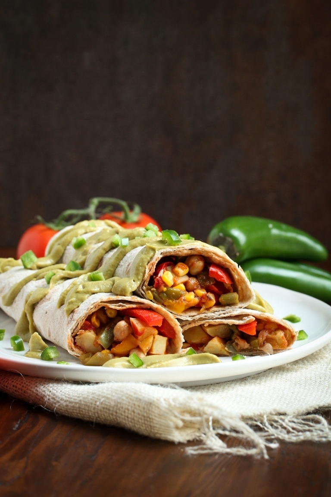

These Easy Vegan Breakfast Burritos are a nice twist to traditional breakfast. Loaded with spices and Mexican flavors and textures, these hearty protein-packed burritos will become a family favorite! They are healthy, plant-based and oil-free and gluten-free if you use gluten-free tortillas!

|Prep time|Total time|
--- | ---
|20m|50m|

## Ingredients

|Ingredient|Quantity|
--- | ---
chopped red or gold potatoes about 1/4 inch size pieces (You want them this small so they fill the burritos easily) | 4 small potatoes
chopped bell pepper strips about 2 inch long (I used a tricolor bag, but use any you like) | 1 bell pepper
salt | 1/2 tsp.
cooked chickpeas | 14oz
corn | 1 cup
smooth salsa | 1 cup + 2 Tbsp.
ground cumin | 1 tsp. + 1/2 tsp.
ground chipotle chile pepper spice | 1/8-1/4 teaspoon 
avocado | 1 large
lime juice | 1/2 Tbsp.
Large Tortillas/Wraps of your choice | ~5
fresh chopped jalapenos | to taste, for garnish

## Directions

1. Roast your potatoes. Preheat the oven to 400F and line a sheet pan with parchment paper, so they don't stick. Spread the chopped potatoes out evenly and season lightly with salt and pepper. Make sure you've chopped your potatoes about 1/4 inch each. Bake for 20 minutes until tender and starting to brown. Make sure they are done by checking one with a fork.
1. Meanwhile, chop your bell peppers into 2 inch strips. Get all your chickpeas, corn and spices ready. When there is about 10 minutes left cooking for your potatoes, you can start to cook the bell peppers. That way everything should be done the same time.
1. Add your bell peppers to a large pan with a 1/4 cup water. Turn to medium heat and cook for 5-8 minutes until tender and the water is basically all evaporated. Don't move on to the next step until all the water has evaporated.
1. Add the chickpeas, corn, salsa, cumin and chipotle chile pepper (if using). Stir well to coat everything. Cook 5-10 minutes until everything is heated through and the sauce has thickened up. When the potatoes are done, stir them in last to the veggie mixture and remove the pan from the heat.
1. While the veggie mixture is cooking, prepare the avocado cumin cream by processing the ingredients either in a blender until smooth. Add more water if necessary.
1. Add the cooked veggie mixture to your tortillas and drizzle the avocado cream inside and on top for presentation, if desired. Add optional chopped jalapeno for garnish. The avocado cream is only good eaten right away, as it will turn brown.
1. You can wrap extra burritos tightly in foil (minus the avocado cream) and store them in the fridge. Just reheat in a toaster oven or regular oven at 300F until warmed through.

Source: [thevegan8.com](https://thevegan8.com/easy-vegan-mexican-breakfast-burritos)
