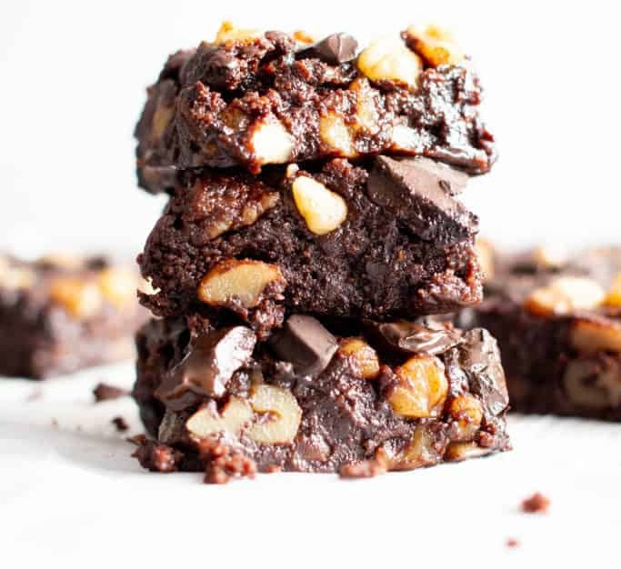

Vegan sweet & salty brownies.

|Prep time|Total time|
--- | ---
|20m|50m|

## Ingredients

|Ingredient|Quantity|
--- | ---
Coconut oil | 2/3 cup
Black chocolate | 100g chopped
Applesauce | 1/2 cup
unsweetened milk substitute | 1/2 cup
Vanilla extract | 1 tsp.
All purpose flour | 1 cup
White sugar | 1 cup
Brown sugar | 1/2 cup
Walnuts | 1/2 cups chopped
Cocoa powder | 1/4 cup
Baking soda | 1 tsp.
Salt | 1 tsp.

## Directions

1. Preheat oven at 375F
1. Melt the coconut oil in the microwave or in a saucepan on the stove. Remove from heat, add chocolate and let stand until melted. Return to microwave or heat for a few seconds if necessary
1. Transfer chocolate mixture to a bowl. Add applesauce, soy milk and vanilla extract. Mix well and set aside.
1. In another bowl, combine flour, white sugar, brown sugar, nuts, cocoa powder, baking soda and salt
1. Add the liquid ingredients to the dry ingredients. Beat mixture for 1 minute with electric mixer. 
1. Pour into an 8 x 8 inch square pan lined with parchment paper and bake for 30 minutes.
1. Turn out, cut into squares and serve

Source: [Jean Phillippe](https://www.renaud-bray.com/Livres_Produit.aspx?id=2915278&def=Mes+grands+classiques+v%c3%a9ganes%2cCYR%2c+JEAN-PHILIPPE%2c9782924646502)
