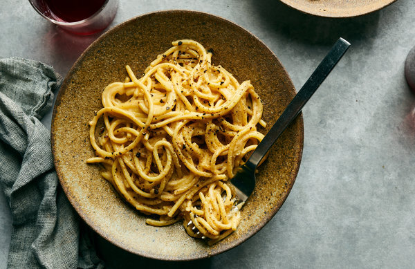

This speedy vegan take on cacio e pepe utilizes a classic technique: Cook the pasta just short of al dente, reserve some of the starchy pasta water to add body to the sauce, then simmer the pasta in its sauce with a splash of pasta water, stirring vigorously until the sauce is emulsified. While many dairy-free pasta recipes look to puréed, soaked cashews for their creaminess, this one cuts corners by using store-bought cashew butter. A spoonful of miso adds depth, and tangy nutritional yeast adds umami. Toasting the peppercorns boosts their flavor and softens them.

|Prep time|Total time|
--- | ---
|25m|30m|

## Ingredients

|Ingredient|Quantity|
--- | ---
kosher salt|
nutritional yeast|1/3 cup (or more, to taste)
cashew butter|1/4 cup
white miso paste|2 Tbsp.
whole black peppercorns| Tbsp.
dried spaghetti|16 ounces (1 box)
extra-virgin olive oil|1/4 cup 
lemon juice|1/2 lemon (optional)

## Directions

1. Bring a large pot of lightly salted water to a boil over high. 
1. Make cashew butter by blending ~1/4 cup of raw cashews and the miso paste. Add water and olive oil as needed. Crush the peppercorns using the flat side of a knife.
1. Add the pasta to the boiling water, reduce the temperature to medium, and cook, stirring occasionally, about 2 minutes before al dente according to package instructions. Reserve 2 1/2 cups pasta cooking water, then drain the pasta.
1. Add 1/4 cup olive oil to the empty pot and heat over medium. Add about two-thirds of the crushed black peppercorns and toast, stirring frequently, until fragrant, 2 to 3 minutes.
1. Add the miso mixture, and stir, then whisk in 1 3/4 cups reserved pasta water until sauce is smooth. Use the pasta water to rince the blender. Add the pasta to the sauce and cook over medium-high, tossing it constantly and vigorously with tongs, until the sauce is glossy and the pasta is fully al dente, 1 to 2 minutes. Add nutritional yeast.
1. Divide among bowls. Drizzle with olive oil, sprinkle with remaining crushed pepper and serve immediately.

Source: [cooking.nytimes.com](https://cooking.nytimes.com/recipes/1020729-vegan-cacio-e-pepe)
