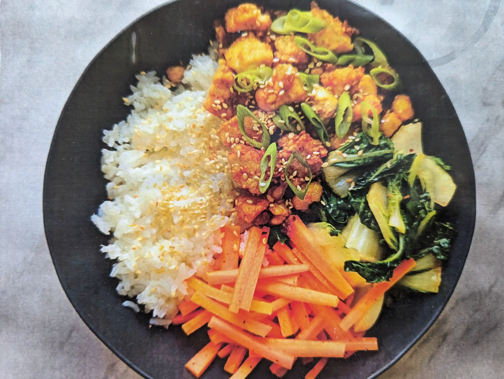

Crispy tofu bits with jasmine rice and veggies.

|Prep time|Total time|
--- | ---
|30m|40m|

## Ingredients

|Ingredient|Quantity|
--- | ---
Firm tofu | 454g
Corn Starch | 1/2 cup
Green Onion | 2
Fresh Ginger | 2 inches
Garlic | 6 cloves
GF Tamari or Soy sauce | 4 Tbsp.
Sesame Oil | 4 Tbsp.
Sesame Seeds | 2 Tbsp.
Jasmine Rice | 1 cup
Cane Sugar (sub brown sugar) | 1 Tbsp.

## Veggies (suggested)

Other options include stir fried broccoli, bell peppers etc.

|Ingredient|Quantity|
--- | ---
Carrot | 2
Rice Vinegar | 2 Tbsp.
Sugar | 1 Tbsp.
Baby Bok Choy | 500g
Red Chili Flakes | 2 tsp.

## Directions

1. Rince, then cook the rice (2 cups of water, salt) for 12-15m.
2. Pat dry the tofu, tear into small bits, toss with cornstarch.
3. Chop the veggies and green onion, grate the garlic.
4. Combine carrots with vinegar and sugar.
5. Toast the sesame seeds for 3-4 minutes, or until golden. Set aside.
6. Cook the tofu with oil until golden and crispy. Add ginger, most of the garlic, white parts of the green onions, soy sauce, sugar and sesame oil. Set aside.
7. Add sesame oil, remaining garlic and chili flakes to the pan and cook for 30 seconds. Add baby bok choy and toss for 1-2 minutes.
8. Combine and serve.

