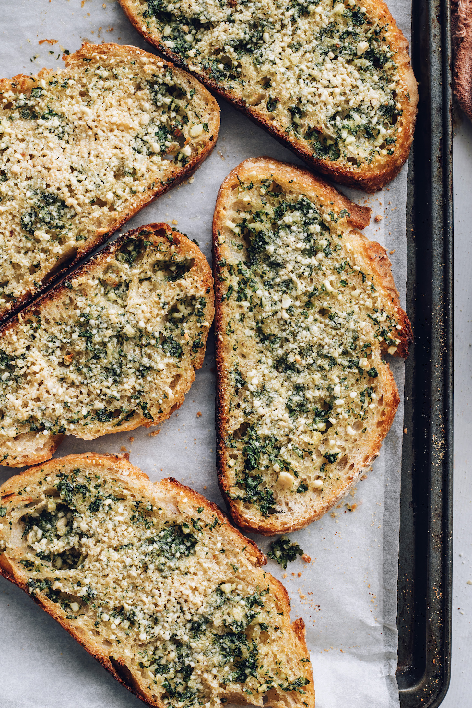

Garlic bread lovers, we have a surprise for you: The BEST Vegan Garlic Bread is here! We took all our knowledge of garlic bread and gave it the vegan twist. It has all the addictive deliciousness you know and love but without the dairy! 

|Prep time|Total time|
--- | ---
|10m|25m|

## Ingredients

|Ingredient|Quantity|
--- | ---
bread | 8-10 slices
unsalted vegan butter | 1/2 cup
finely minced garlic | 4 large cloves
parsley | 2 Tbsp.
sea salt | 1/2 tsp.
black pepper | 1 pinch
vegan permesan cheese | 3-7 Tbsp.

## Directions

1. Preheat the oven to 375F.
1. In a small mixing bowl, combine the vegan butter, garlic, parsley, salt, and pepper. Mix well until the parsley and garlic are evenly distributed and the butter is slightly softened and spreadable.
1. Place ~1 Tbsp of butter mixture on each slice of bread, spreading it evenly, reaching all the way to the edges of the bread.
1. Evenly sprinkle ~1-2 tsp of vegan parmesan cheese on each slice of bread.
1. Place the bread in the oven for 12-15 minutes, or until the edges are just turning golden and the vegan parmesan is looking lightly toasty.

Source: [minimalistbaker.com](https://minimalistbaker.com/the-best-vegan-garlic-bread/)
