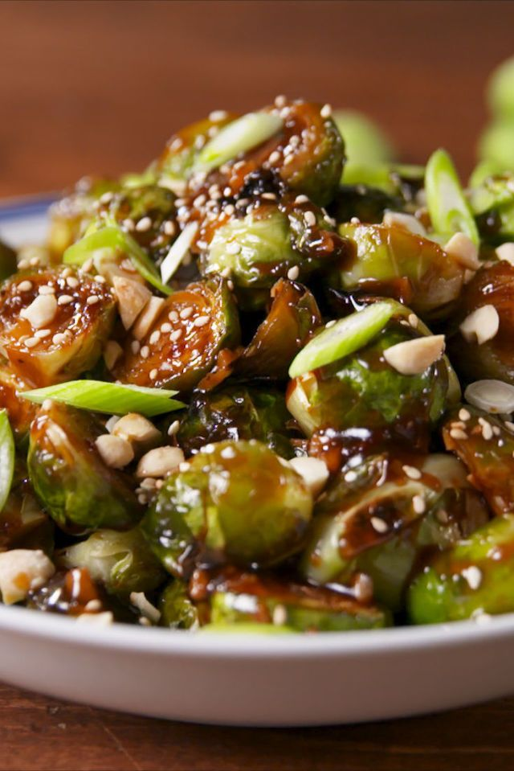

Inspired by the popular Chinese takeout dish Kung Pao Chicken, these saucy Brussels sprouts are dangerously addictive. If you want to up the spice level, feel free to add red chili peppers with the garlic. 

|Prep time|Total time|
--- | ---
|10m|35m|

## Ingredients

|Ingredient|Quantity|
--- | ---
|Brussels sprouts|2lb.|
|olive oil|2 tbsp. |
|kosher salt||
|black pepper||
|sesame oil|1 tbsp. |
|garlic, minced|2 cloves|
|cornstarch|1 tbsp. |
|low-sodium soy sauce|1/2 cup|
|water|1/2 cup |
|apple cider vinegar|2 tsp. |
|hoisin sauce|1 tbsp. |
|packed brown sugar|1 tbsp. |
|garlic chili sauce|2 tsp. |
|crushed red pepper flakes|Pinch|
|Sesame seeds, for garnish||
|Green onions, thinly sliced, for garnish||
|Chopped roasted peanuts, for garnish||

## Directions

1. Preheat oven to 425°. On a large rimmed baking sheet, toss Brussels with olive oil and season with salt and pepper.
1. Bake until Brussels sprouts are tender and slightly crispy, about 20 minutes. Transfer Brussels sprouts to a large bowl (but keep the baking sheet close by). Preheat broiler.
1. In a small skillet over medium heat, heat sesame oil. Add garlic and cook, until fragrant, about 1 minute. Stir in cornstarch. Add soy sauce, water, apple cider vinegar, hoisin sauce, brown sugar, and garlic chili paste. Season with salt, pepper and red pepper flakes. Bring mixture to a boil, then reduce heat and simmer until thickened, about 3 minutes.
1. Pour sauce over Brussels sprouts and toss to combine. Return Brussels sprouts to baking sheet and broil until Brussels sprouts are glazed and sticky.
Garnish with peanuts, sesame seeds, and green onions before serving.

Source: [delish.com](https://web.archive.org/web/20210119071706/https://www.delish.com/cooking/recipe-ideas/recipes/a57880/kung-pao-brussels-sprouts-recipe/)
