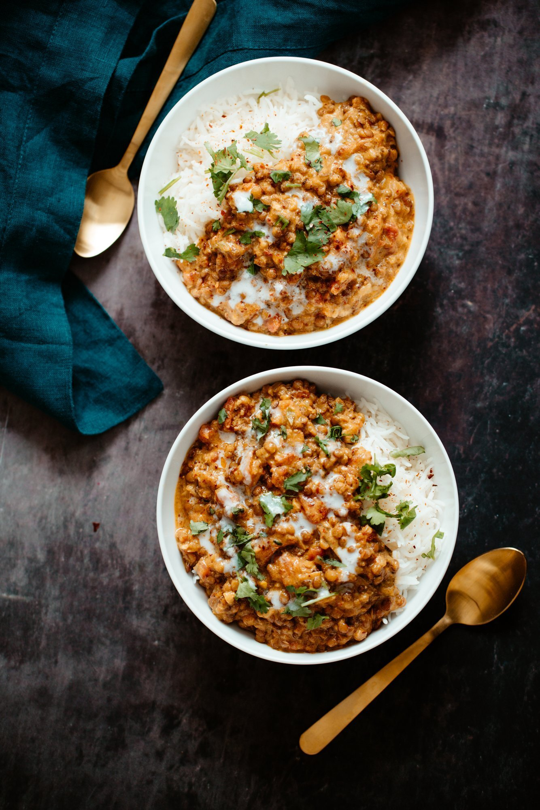

Make this easy Vegan Curry Lentil Casserole whenever that craving for restaurant-style creamy lentil dishes hits. Brown lentils simmered in a fragrant coconut curry broth served over rice! So easy, so delicious. Gluten-free, too.

|Prep time|Total time|
--- | ---
|10m|90m|

## Ingredients

|Ingredient|Quantity|
--- | ---
    oil|2 tsp. 
    garlic minced|3 cloves 
    onion finely chopped|1/4 cup 
    hot green chili finely chopped|1
    ground cumin|1/2 tsp. 
    ground coriander|1/2 tsp. 
    turmeric|1/2 tsp. 
    garam masala or curry powder|1 tsp. 
    bay leaf|1
    black pepper|1/8 tsp. 
    cinnamon|1 good pinch 
    lentils brown or green|¾ cup (144 g)
    tomatoes|14 oz. can 
    coconut milk|14 oz. can 
    vegetable broth divided|2 ½ cups
    salt|¾ tsp. divided
    almond/cashew/sun butter - warmed|2 Tbsp. 
    Lemon juice & cilantro|for garnish

## Directions

1. Add oil to a casserole dish. Add in garlic, onion, green chili, spices and ¼ tsp salt - mix well. Preheat the oven to 400℉ (205C)
1. Once heated, place the casserole dish in the oven for 5-8 minutes or until onions start to turn golden
1. Remove dish from the oven and add in the lentils, tomatoes, coconut milk, remaining salt and 2 cups of broth, mix well. (reserve 2 tbsp coconut milk for garnish if you wish)
1. Place the dish back in the oven and cook for 1 hour or 1 hour and 10 mins or until lentils are cooked to preference (taste using a spoonful to see if they’re done)
1. Once done, remove the dish from the oven, and while the mixture is still hot, first mix almond butter with warmed 1/2 cup of broth, add this mixture in, and stir until combined
1. Adjust flavor and spice as needed. Add in some lemon juice and cilantro for garnish, as desired
1. Serve with some fresh rice, flatbread, naan bread, or pita bread

Source: [veganricha.com](https://www.veganricha.com/lentil-curry-casserole/)
