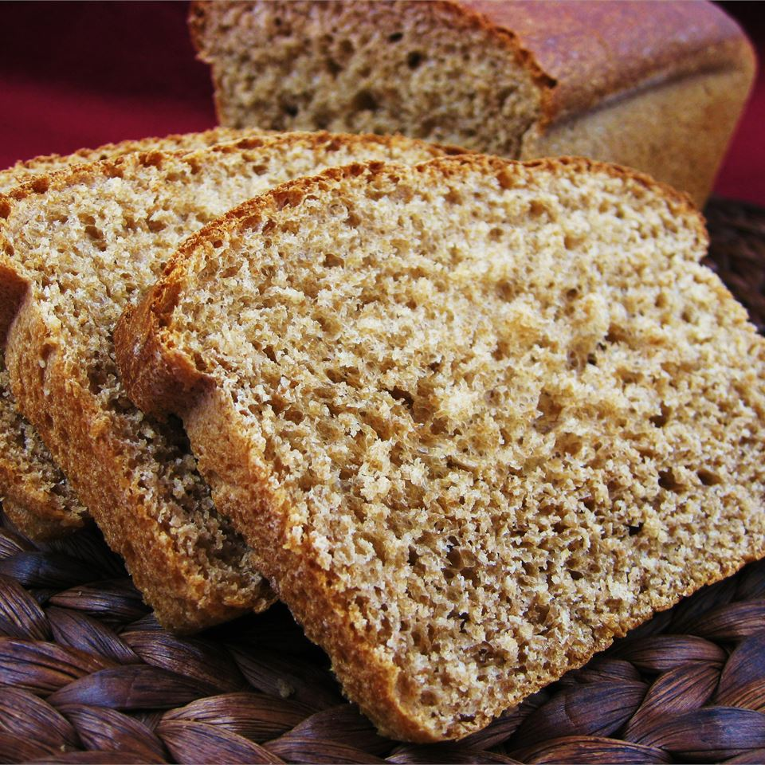

Chewy, hearty, whole wheat bread for bread machines!

|Prep time|Total time|
--- | ---
|5m|~3h00|

## Ingredients

|Ingredient|Quantity|
--- | ---
whole wheat flour|2 1/2 cup 
bread flour|1/2 cup 
salt|1/3 tsp. 
water|1 1/4 cup 
maple syrup|4 Tbsp. 
olive oil|2 Tbsp.
active dry yeast|1 1/2 tsp.

## Directions

1. Place ingredients in the pan of the bread machine in the order recommended by the manufacturer.
1. Select wheat bread cycle, 1.5 pound; press Start.

Source: [allrecipes.com](https://www.allrecipes.com/recipe/73635/maple-whole-wheat-bread/)
