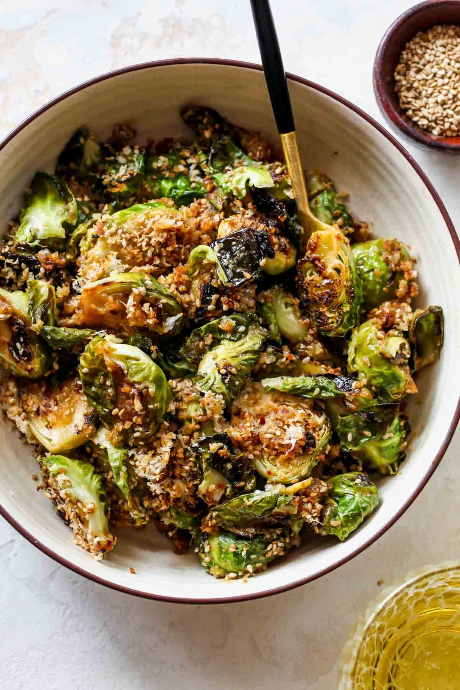

These Miso-Sesame Glazed Brussels Sprouts with crispy panko topping are a restaurant-worthy side. Charred and crispy 
on the outside, meaty on the inside, and with the most addictive miso glaze, they’re a must-make!

|Prep time|Total time|
--- | ---
|15m|15m|

## Ingredients

|Ingredient|Quantity|
--- | ---
white miso paste|2 Tbsp. 
Dijon mustard|2 Tbsp. 
rice vinegar (sub sherry vinegar)|2 Tbsp. 
toasted sesame oil|1 Tbsp. 
soy sauce or tamari|1 Tbsp. 
chili flakes|1/2 tsp. 
neutral cooking oil|1/4 cup plus 2 Tbsp. 
Brussels sprouts, trimmed and halved|1 lb. 
kosher salt|1/4 tsp. 
Panko breadcrumbs|1/4 cup 
toasted sesame seeds|2 Tbsp. 
nutritional yeast|2 Tbsp. 

## Directions

1. Combine miso paste, Dijon mustard, rice vinegar, sesame oil, soy sauce, and chili flakes in a blender; blend on low speed until combined. Increase the blender speed to medium, and slowly stream in 1/4 cup of oil. Set aside.
1. Preheat oven broiler to HIGH.
   Heat remaining 2 Tbsp. of oil in a large oven-safe skillet over medium-high. Once hot, add Brussels sprouts and cook for 7 to 8 minutes, stirring every few minutes, until nicely browned and tender. Season with salt.
   Meanwhile, add panko, nutritional yeast, and sesame seeds to a medium bowl; toss to combine.
1. Pour miso-sesame mixture into skillet with Brussels sprouts and toss to coat. Sprinkle panko mixture overtop, and transfer skillet to upper center rack of oven. Broil for 1 to 2 minutes, until a golden-brown crust forms.
    Remove from oven, stir, and serve!

Source: [dishingouthealth.com](https://dishingouthealth.com/miso-sesame-glazed-brussels-sprouts/#recipe)
