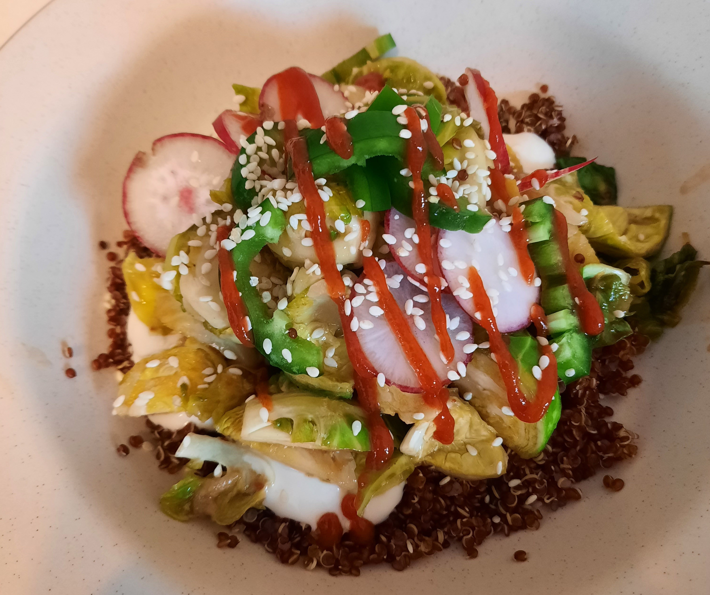

With Black quinoa and Citrus Mayo.

|Prep time|Total time|
--- | ---
|30m|40m|

## Ingredients

|Ingredient|Quantity|
--- | ---
garlic | 3 cloves
ginger | 1 oz fresh or 2 tsp. ground
lime | 1
radishes | 3
agave | 2 tsp.
black quinoa | 3/4 cup
Vegan mayonaise | 1/4cup
Bali BBQ sauce | 1/4cup
Sesame seeds | to taste
Sriracha | to taste
Jalapeno | 2

## Directions

1. Mince garlic and ginger. Trim and halve the Brussels sprouts. Thinly slice the radishes and japapeno.
1. Add 2 tsp. lime juice, 1/2 tsp. agave to sliced radishes in a small bowl and set aside to marinate.
1. Cook quinoa.
1. Add brussels sprouts and a pinch of salt to skillet over high heat until well browned on one side. Reduce heat and cook until fork-tender, 10-12 minutes.
1. Add lime zest, lime juice and vegan mayonaise to small bowl and set aside.
1. Add garlic, ginger, remaining agave and Bali BBQ sauce to the brussel sprouts and continue cookie for 1-2 minutes
1. Divide the quinoa between bowls and top with brussel sprouts and marinated radishes. Drizzle with citrus Mayo and sriracha. Sprinkle with sesame seeds and japapeno slices.

Source: 
