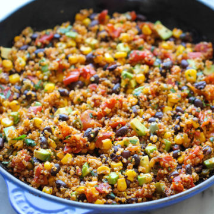

With a fun Mexican twist, this dish is chockfull of so many amazing flavors, from the tangy lime juice to the hint of spiciness from the chili powder and jalapeno. And not only is this healthy and nutritious but it’s also unbelievably easy to make. Simply throw everything into the skillet and that’s it. Even the quinoa is cooked right in the pan, really letting the flavors soak in.

|Prep time|Total time|
--- | ---
|10m|35m|

## Ingredients

|Ingredient|Quantity|
--- | ---
olive oil|1 Tbsp. 
garlic, minced|2 cloves 
jalapeno, minced|1
quinoa|1 cup 
vegetable broth|1 cup 
black beans, drained and rinsed|1 (15 oz.) can 
fire-roasted diced tomatoes|1 (14.5 oz) can 
corn kernels, frozen, canned or roasted|1 cup 
chili powder|1 tsp. 
cumin|1/2 tsp. 
Kosher salt and freshly ground black pepper|to taste
avocado, halved, seeded, peeled and diced|1 
Juice of 1 lime
chopped fresh cilantro leaves|2 Tbsp. 

## Directions

1. Heat olive oil in a large skillet over medium high heat. Add garlic and jalapeno, and cook, stirring frequently, until fragrant, about 1 minute.
1. Stir in quinoa, vegetable broth, beans, tomatoes, corn, chili powder and cumin; season with salt and pepper, to taste. Bring to a boil; cover, reduce heat and simmer until quinoa is cooked through, about 20 minutes. Stir in avocado, lime juice and cilantro.
1. Serve immediately.

Source: 
