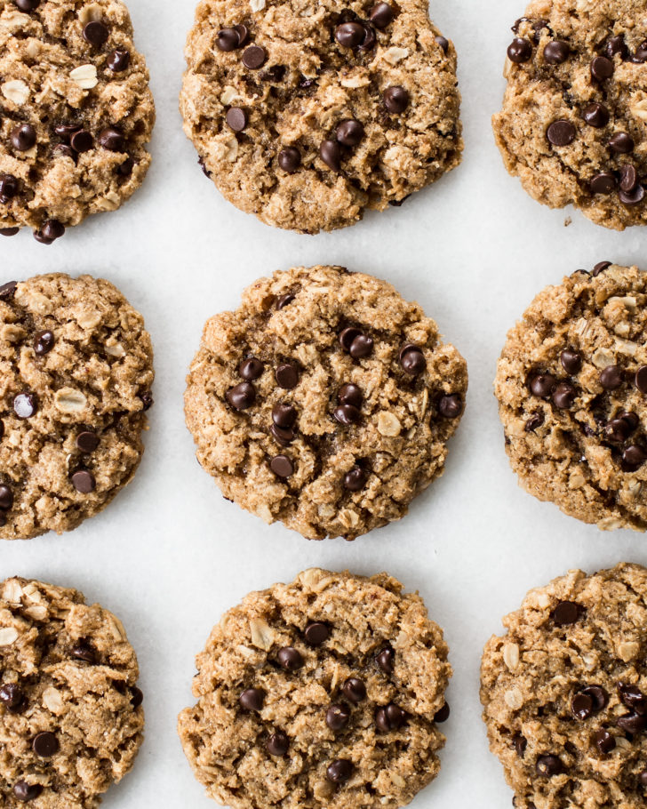

Peanut butter, shredded coconut, and rolled oats form the base of these soft and chewy chocolate chip cookies. Brown sugar lends a light caramel flavour which pairs so well with the peanut butter and sea salt. They're completely flourless, in addition to being vegan and gluten-free, but no one will be the wiser

|Prep time|Total time|
--- | ---
|10m|23m|

## Ingredients

|Ingredient|Quantity|
--- | ---
ground flax (sub 1/2 Tbsp. ground chia)|1 Tbsp. 
water|3 Tbsp. 
unsweetened shredded coconut|1/2 cup 
gluten-free rolled oats|1/2 cup 
brown sugar|1/2 cup packed
baking powder|1 tsp.
fine sea salt (reduce salt if using salted peanut butter)|1/2 tsp. 
mini non-dairy chocolate chips|1/4 cup 
natural smooth peanut butter|1/2 cup
pure vanilla extract|1 tsp. 
pure maple syrup|2 Tbsp.

## Directions

1. Preheat the oven to 350°F (180°C), and line a large baking sheet with parchment paper.
1. Add the ground flax and water to a medium bowl, and whisk until combined. Set aside.
1. To a large bowl, add the coconut, rolled oats, brown sugar, baking powder, salt, and chocolate chips. Stir to combine.
1. To the same bowl as the flax mixture, add the peanut butter, vanilla, and maple syrup. Stir until smooth. The mixture will be very thick.
1. Using a spatula (this helps to scoop up every last bit), scoop the wet mixture on top of the dry ingredients, and stir until thoroughly combined. The batter will be very dry at first, but this is normal! You'll need to put some elbow grease into stirring. I like to knead the dough with my hands to make it all come together. (You can also use electric beaters, but I prefer to get in there with my hands and knead until no dry patches remain.) If for some reason your dough is still too dry to shape into balls, add a teaspoon of water and mix again.
1. Lightly wet your hands (shaking off excess water) and form about 13 balls, just smaller than golf balls. Stop and rinse off sticky hands as needed. Place each ball onto the prepared baking sheet about 2 to 3 inches apart. Gently press down on each ball to flatten into a 1-cm (just less than 1/2-inch) thick disc. If there are any leftover chocolate chips in the bottom of the bowl, scoop them up and push them into the tops of the cookies.
1. Bake for 12 to 14 minutes. The cookies tend to only spread out a little. They'll be delicate coming out of the oven, but they will firm up as they cool. The bottoms will be golden. Allow the cookies to cool on the baking sheet for 10 minutes before carefully transferring to a cooling rack until completely cooled. Once cooled, the cookies will remain soft and chewy. For a firmer texture, transfer the cookies to the freezer (my favourite way to enjoy them!). Store leftovers in an airtight container or freezer bag in the freezer for up to 1 month. 

Source: [ohsheglows.com](https://ohsheglows.com/2019/06/29/flourless-peanut-butter-cookies/)
