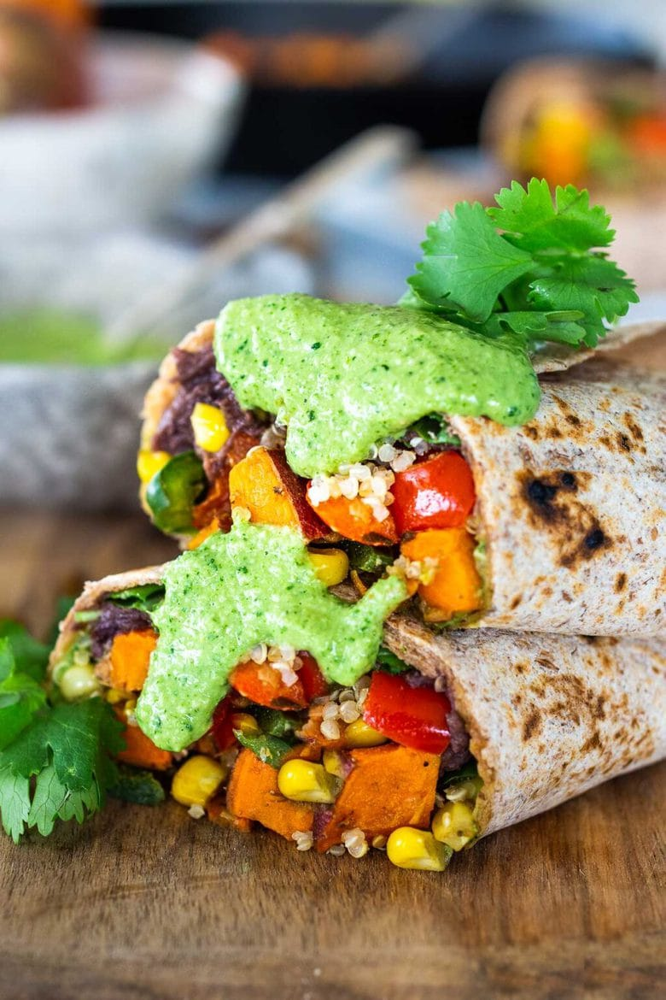

These vegan Peruvian Burritos are filled with roasted sweet potato, fresh corn, peppers, quinoa, whipped black beans, and drizzled with Spicy Peruvian Green Sauce. Flavorful, filling, vegan and Delicious!

|Prep time|Total time|
--- | ---
|30m|1h|

## Ingredients

|Ingredient|Quantity|
--- | ---
yam or sweet potato, diced|1 small-medium 
olive oil|
salt and pepper|to taste
|
dry quinoa|3/4 cup 
water|1 1/2 cups 
|
olive oil|1 Tbsp. 
onion, diced|1/2 
garlic, rough chopped|4 cloves 
corn kernels|1 cup
red bell pepper, diced|1
poblano chili|1
salt|1/2 tsp. 
cumin|1 tsp. 
coriander|1 tsp. 
dried oregano|1/2 tsp. 
|
refried black beans|1 can 
oil|1 Tbsp. 
salt|1/4 tsp. 
chili powder|1/2 tsp. 
cumin|1/2 tsp. 
extra-large tortillas (14-16")|4

### Vegan Aji Verde Sauce:

1/3 cup raw cashews
1/3 cup water
2 garlic cloves
1/2 –1 jalapeno ( or 1/2 a serrano chili)
1/2 teaspoon salt
1 1/2 cups cilantro, small stems ok
1–2 tablespoon lime juice

## Directions

1. Preheat oven to 425F and gather ingredients & cut veggies.
1. **BAKE SWEET POTATOES**: Dice the sweet potatoes into 1/2 inch cubes and place on a parchment-lined sheet pan. Toss with a little olive oil, and a generous five-finger pinch of salt and pepper. Spread out and bake in the middle of the oven until crispy and tender, 20-25 minutes.
1. **COOK QUINOA**: At the same time, bring quinoa, water, and pinch of salt to boil in a medium pot. Once boiling, cover, turn heat to low and cook until all the water is gone about 15 minutes. Turn heat off and leave covered. Fluff before serving.
1. **SAUTE FILLING**: Also at the same time, in a large skillet, heat oil over medium-high heat. Saute onions 2-3 minutes until they just begin to soften. Add garlic, corn and peppers and lower heat to med, sauteeing until tender, about 10 minutes. Season with the salt, cumin, coriander and oregano. Set aside. When the sweet potatoes are tender, add them to these veggies.
1. **BLEND THE  Peruvian Green Sauce (AJI VERDE SAUCE)**: While the veggies are sauteeing, blend the Aji Verde ingredients together using a blender. Start with cashews and water, blending till smooth and creamy, scraping down the sides. Add remaining garlic, chili, salt, cilantro and lime juice. Blend until relatively smooth. Scrape it into a small bowl.
1. **WHIP THE BLACK BEANS**: Place 1 can refried black beans into a medium pot, breaking them up with a fork.  Add 1/4 cup water (or more) to loosen. Gently warm over medium-low heat, whipping with a fork until they are smooth and creamy. Add a drizzle of olive oil, salt and spices. If you don’t care about it being “vegan” stir in grated melty cheese or a dollop of sour cream for extra richness. Whip with fork until creamy and flavorful. You want these to be slightly salty. Cover and turn heat off.
1. **ASSEMBLE BURRITOS**: Heat tortillas up until soft and pliable (over a gas flame, or in the oven on the rack). Spread with whipped black beans “the glue”, a few tablespoons quinoa, 1/2 cup veggies and 2-3 tablespoon of Peruvian Green Sauce. Roll up, tucking the ends in as best you can. Enjoy!
1. **Peruvian BURRITO BOWLS**: Spoon some warm whipped black beans into the bottom of a bowl. Top with some quinoa, vegges and AJI VERDE Sauce. Garnish with avocado slices, diced tomatoes, cilantro, pumpkin seeds, sunflower sprouts.  If making bowls instead of burritos, I would double the beans for 4-6 people.

Source: [feastingathomne.com](https://www.feastingathome.com/peruvian-burritos/)
