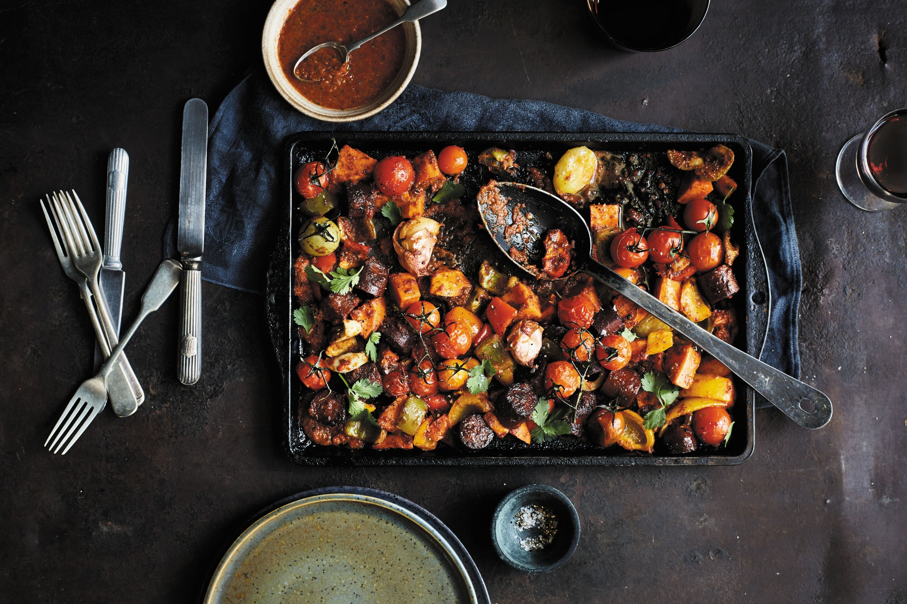

This is a quick and easy-to-throw-together, eat-the-rainbow revelation. Colored heirloom tomatoes are a great addition if you can get hold of them. The piri piri sauce is wonderful, so consider making double and keeping half for another recipe. Serve with brown rice for an even healthier meal.

|Prep time|Total time|
--- | ---
|?m|?m|

## Ingredients

### For the bake

|Ingredient|Quantity|
--- | ---
medium sweet potatoes|2
Olive oil|
lemon|1
red bell pepper|1
green bell pepper|1
yellow bell pepper|1
garlic|3 cloves
shop-bought veggie chorizo sausages|10 oz.
cherry tomatoes|20
cooked basmati rice, to serve|4 cups 
cilantro|3/4 oz. 
salt and black pepper|

### For the Piri Piri Sauce:
|Ingredient|Quantity|
--- | ---
red onion|1
garlic|4 cloves
red bell pepper|1
fresh red chiles (Scotch bonnet, red, or bird’s-eye)|2
smoked paprika|2 Tbsp. 
dried oregano|1 tsp. 
red wine vinegar|2 Tbsp. 
fresh basil|1 large bunch 
lemon|1

## Directions

1.  Preheat oven to 350°F
1. First, cook the sweet potatoes. Peel the sweet potatoes and cut them into 3/4-inch cubes.
1. Cut the bell peppers in half, cut out the stems and seeds, and cut the flesh into 3/4-inch cubes, then put them in the roasting pan. Use the back of a knife to lightly crush the 3 garlic cloves and add them to the pan. Drizzle with a little olive oil and sprinkle with salt and pepper. Add the sweet potatoes to the peppers and put the pan in the oven for 10–15 minutes, until the peppers have small black patches on the skins.
1. Meanwhile, cut up store-bought sausages into bite-sized pieces and cook following the instructions on the package.
1. To make the piri piri sauce, peel and roughly chop the onion and garlic. Cut the bell pepper in half and cut out the stem and seeds. Rip the stems from the chiles, cut them in half lengthwise, and remove the seeds if you prefer a milder sauce. Put the onion, garlic, pepper, and chiles in the blender with the paprika, oregano, red wine vinegar, and basil. Grate in the zest of the lemon, then cut it in half and squeeze in the juice, catching any seeds. Add a drop of water and blend to a smooth paste. Taste and adjust the seasoning, if necessary.
1. Remove the roasting pan from the oven. Transfer the sausages and piri piri sauce to the pan and mix everything together. Add the cherry tomatoes and put the pan back in the oven for 15 minutes, until the potatoes and peppers are cooked and the sauce is piping hot.
1. Heat the rice or cook it following the instructions on the package.
1. Pluck the leaves from the cilantro and discard the stems. Coarsely chop the leaves and sprinkle them over the vegetables.
1. Serve with rice.

Source: [epicurious.com](https://www.epicurious.com/recipes/food/views/vegetarian-piri-piri-chorizo-bake)
