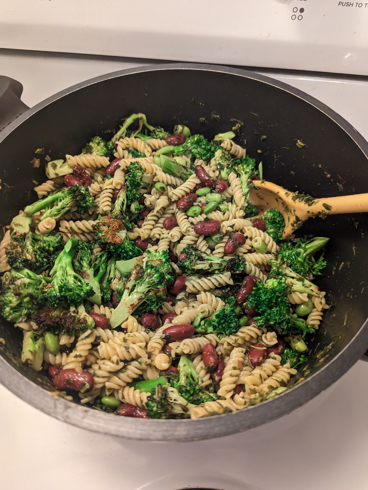

Very quick and simple pesto pasta, perfect for meal prep.

|Prep time|Total time|
--- | ---
|15m|20m|

## Ingredients

|Ingredient|Quantity|
--- | ---
pasta | 8 onces (225g)
olive oil | 2 Tbsp.
peanut oil | 2 Tbsp.
nutritional yeast | 3 Tbsp.
garlic, minced | 3 cloves
kidney beans | 15oz can
frozen edamame | 2 cups
broccoli florets | 2 small crowns
arugula or basil pesto | 1 store-bought package

## Directions

1. Cook pasta al dente, according to package instructions
1. Stir-fry brocoli and edamame in wok with peanut oil, add garlic and cook for about 30 seconds
1. Combine pasta, veggies, nutritional yeast, beans, pesto and olive oil in large pot. Heat through.

Source: [mealpreponfleek.com](https://mealpreponfleek.com/vegan-arugula-pesto-pasta-meal-prep/#recipe)
