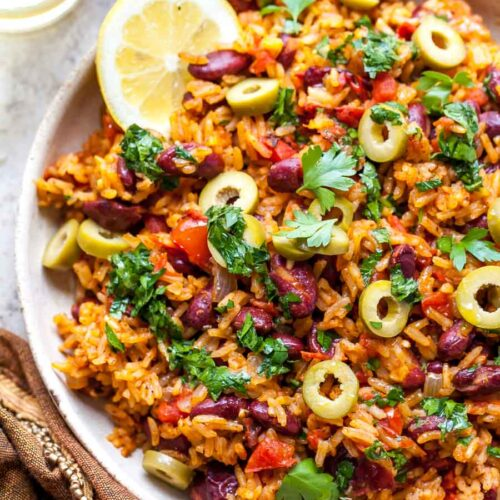

You can’t beat a super simple, family-friendly recipe that leans on pantry staples. This one also comes together in one pot, making it the perfect weeknight recipe.

This classic Spanish dish is a total flavor fiesta both kids and adults will love. Plus, it makes for some of the BEST leftovers. (Truly, we’re enjoying it on repeat over here with zero complaints.)

|Prep time|Total time|
--- | ---
|10m|50m|

## Ingredients

|Ingredient|Quantity|
--- | ---
extra-virgin olive oil|2 Tbsp. 
yellow onion, finely chopped|1
garlic, minced|3 cloves
paprika|1 1/2 tsp. 
kosher salt|1 1/4 tsp. 
chili powder|1 tsp. 
dried oregano|1 tsp. 
black pepper|1/2 tsp. 
cayenne pepper (optional for added heat)|1/4 tsp. 
long-grain white rice (such as jasmine or basmati)|2 cups 
fire-roasted diced tomatoes (sub 1 cup jarred salsa)|1 (14.5-oz.) can 
kidney beans, drained and rinsed|2 (15.5-oz.) cans 
vegetable or chicken broth (sub water)|3 cups 
sliced green olives|1/3 cup 

## Directions

1.  Heat oil in a large skillet with a fitted lid over medium. Add onion; cook 5 minutes, until softened. Add garlic, paprika, salt, chili powder, oregano, black pepper, and cayenne; cook 2 minutes, stirring often, until aromatic. Stir in rice; cook 2 minutes, until slightly translucent. Stir in tomatoes, beans, and broth (or water). Bring mixture to a boil, reduce to medium-low, and simmer, covered, until liquid is absorbed and rice is tender, about 25 minutes.
1. Meanwhile, prepare parsley oil (if using) by combining parsley, lemon zest and juice, and olive oil in a small bowl; stir well.
1. Scatter olives over Spanish Beans and Rice and drizzle with parsley oil.

Source: [dishingouthealth.com](https://dishingouthealth.com/spanish-rice-and-beans-one-pot/)
