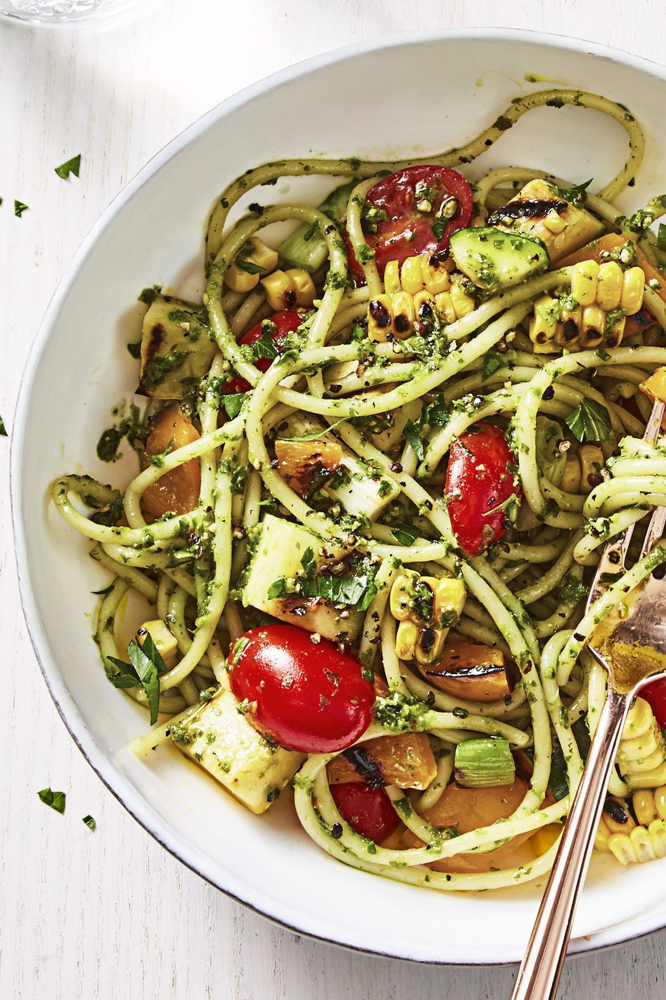

Loaded with all your favorite summer veggies, this pesto pasta is light and easy on warm nights.

|Prep time|Total time|
--- | ---
|20m|40m|

## Ingredients

|Ingredient|Quantity|
--- | ---
spaghetti|1 lb.|
ears corn, shucked|2|
yellow squash, cut into 1/2"-thick slices|1 medium|
zucchini, cut into 1/2"-thick slices|1 medium|
bell pepper, seeded and cut into sixths|1 small|
green onions, trimmed|4|
olive oil|2 tbsp.|
lemon|1|
store-bought refrigerated pesto|1/2 cup|
grape tomatoes, halved|1 pt.|
fresh parsley, chopped|1/4 cup packed|

## Directions

1. Heat grill on medium-high. Cook spaghetti as label directs. Rinse, drain well and let cool completely.
1. In large bowl, toss corn, squash, zucchini, bell pepper and onions with oil and 1/2 teaspoon each salt and black pepper until well coated. Grill corn, turning, 10 minutes or until charred in spots. Grill squash, zucchini and bell pepper 4 to 6 minutes or until tender and grill marks appear, turning once. Grill onions 2 minutes or until tender and slightly charred, turning occasionally.
1. Into large bowl, from lemon, grate 1/2 teaspoon zest and squeeze 2 tablespoons juice. Whisk in pesto and 1/2 teaspoon each salt and pepper.
1. Chop squash, zucchini, pepper and onions; add to bowl with pesto. Cut kernels from cobs; add to bowl along with tomatoes, parsley and cooked pasta. Toss to combine. Serve at room temperature.

Source: [goodhousekeeping.com](https://www.goodhousekeeping.com/food-recipes/a44097/summer-pesto-pasta-recipe/)
