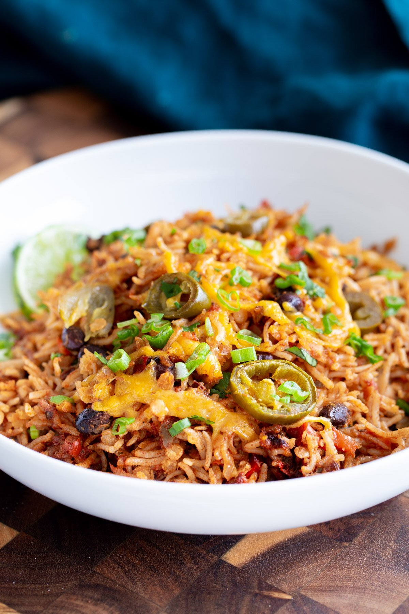

This Tex Mex Rice Casserole makes for a delicious one-pan meal! It’s family-friendly, budget-friendly, gluten-free, packed with simple and easily modifiable ingredients! Also perfect for meal prep.

|Prep time|Total time|
--- | ---
|15m|55m|

## Ingredients

|Ingredient|Quantity|
--- | ---
oil | 2 Tbsp.
chopped onion | 1 cup
chopped red bell pepper | 1/2 cup
chopped green pepper | 1/2 cup
ground cumin | 1 tsp.
salt | 1/4 tsp.
bay leaves | 2
white rice | 1 cup
dried red lentils | 1/4 cup
black beans | 15 oz
chili powder | 2 tsp.
pepper flakes | 1/2 tsp.
black pepper | 1/4 tsp.
garlic powder | 1/4 tsp.
onion powder | 1/2 tsp.
oregano | 1 tsp.
hot sauce | 2-3 Tbsp.
fire roasted diced tomatoes | 15 oz.
veggie broth | 1 3/4 cups

## Directions

1. Pre-heat oven at 400F
1. In a 9x11 or similar sized baking dish brush the 1 tsp. oil on the baking dish then add the onion, bell peppers, cumin, bay leaves and salt. Mix well then drizzle the remaining oil on top and mix lightly again.
1. Bake for 9-12 minutes or until mixture is starting to get golden.
1. Remove the dish from the oven, add in the spices and tomatoes and mix in, then add the rest of the ingredients, drained rice. Cover with foil and put it back for 30-35 minutes.
1. Remove from the oven, take off the sheet or the foil. Fluff the rice a little bit then top it with cheese, pickled jalapeno and put back in oven for the cheese to melt. You can also add some fresh jalapeño or serrano pepper slices. Broil it for 2-3 minutes until the cheese has melted.
1. Garnish with green onion, lime juice

Source: [veganricha.com](https://www.veganricha.com/tex-mex-rice-casserole/#recipe)
