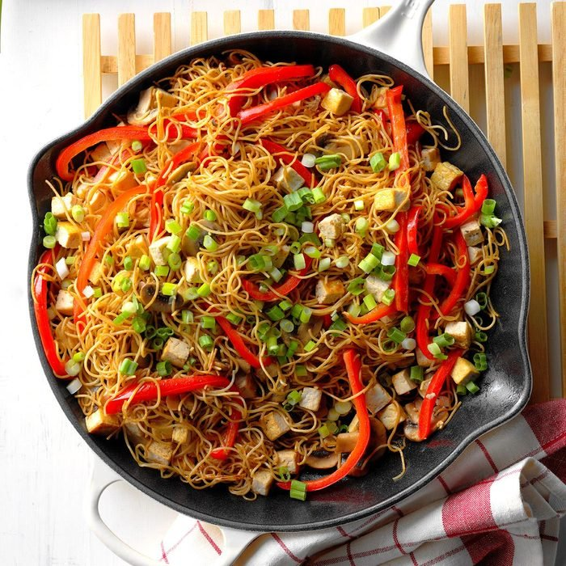

This is an easy recipe for a "tofu beginner," as it teaches people how to use it. If you have time, one way to prepare it is to cut the tofu block in half and wrap well in a terry kitchen towel. Let it sit in the fridge for at least an hour to absorb excess water. For a complete meal, serve with Chinese soup and egg rolls!

|Prep time|Total time|
--- | ---
|Xm|Xm|

## Ingredients

|Ingredient|Quantity|
--- | ---
uncooked whole wheat angel hair pasta|8 oz.
sesame oil, divided|3 Tbsp. 
extra-firm tofu|1 package (16 oz.) 
sliced fresh mushrooms|2 cup
sweet red pepper, julienned|1 medium 
reduced-sodium soy sauce|1/4 cup 
green onions, thinly sliced|3

## Directions

1. Cook pasta according to package directions. Drain; rinse with cold water and drain again. Toss with 1 tablespoon oil; spread onto a baking sheet and let stand about 1 hour.
1. Meanwhile, cut tofu into 1/2-in. cubes and blot dry. Wrap in a clean kitchen towel; place on a plate and refrigerate until ready to cook.
1. In a large skillet, heat 1 tablespoon oil over medium heat. Add pasta, spreading evenly; cook until bottom is lightly browned, about 5 minutes. Remove from pan.
1. In same skillet, heat remaining oil over medium-high heat; stir-fry mushrooms, pepper and tofu until mushrooms are tender, 3-4 minutes. Add pasta and soy sauce; toss and heat through. Sprinkle with green onions.

Source: [tasteofhome.com](https://www.tasteofhome.com/recipes/tofu-chow-mein/)
