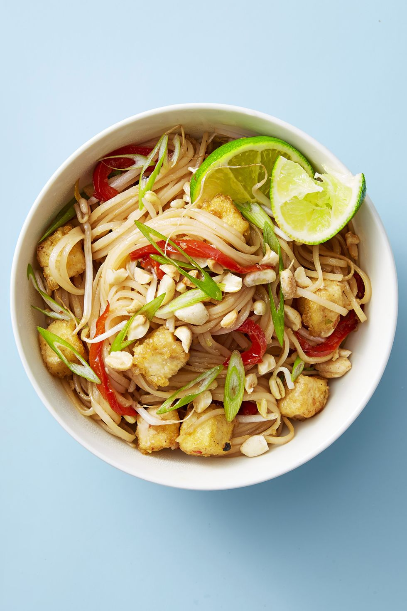

Crispy fried tofu rounds out this sweet and spicy noodle dish.

|Prep time|Total time|
--- | ---
|20m|35m|

## Ingredients

|Ingredient|Quantity|
--- | ---
|extra-firm tofu, drained|14 oz.|
|cornstarch|2 tbsp.|
|rice noodles|8 oz.|
|low-sodium soy sauce|1/4 cup|
|brown sugar|2 tbsp.|
|sweet chili sauce|2 tsp.|
|Juice of 1 lime, plus lime wedges for serving|
|garlic, grated|1 clove|
|oil|1 tbsp.|
|red pepper, sliced|1|
|bean sprouts|2 cup|
|scallions, thinly sliced|2|
|Chopped peanuts|1/4 cup|

## Directions

1. Slice tofu 1/2- inch thick. Place on rimmed baking sheet between layers of paper towels; sandwich with second sheet and place cast iron skillet on top to weigh down 10 minutes. Cut into cubes, transfer to bowl and toss with cornstarch.
1. Meanwhile, cook noodles per package directions and rinse with cold water; drain.
1. In small bowl, combine soy sauce, sugar, chili sauce, lime juice and garlic; set aside.
1. Heat 1 tablespoon oil in large nonstick skillet on medium. Add pepper and cook until tender, 4 to 5 minutes. Remove from skillet. Add tofu and cook, tossing, until golden brown, 4 to 5 minutes. Add noodles and sauce and toss to combine. Fold in pepper, sprouts and scallions and cook 2 minutes.

Source: [goodhousekeeping.com](https://www.goodhousekeeping.com/food-recipes/easy/a48188/tofu-pad-thai-recipe/)
