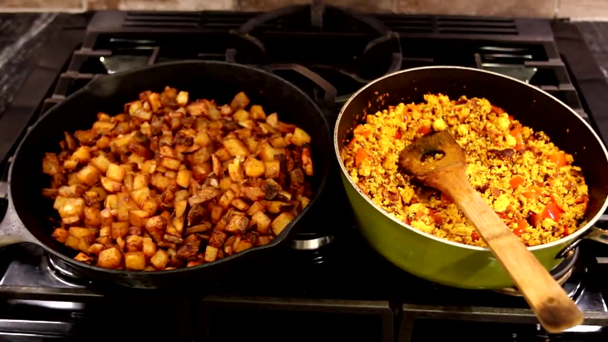

Breakfast tofu scramble with potatoes and pepper recipe by Anthony Fantano.

|Prep time|Total time|
--- | ---
|10m|30m|

## Ingredients

|Ingredient|Quantity|
--- | ---
russet potato, cubed|3
yellow onion, chopped|1
red bell pepper, chopped|1
olive oil|
garlic powder|
paprika|
black pepper|
salt|
tumeric|
curry powder|

## Directions

1. Preheat oven at 400F
1. Cook potatoes in the microwave for about 6m
1. Toss potatoes and onion with salt, black pepper, paprika, garlic powder and oil. Roast in the oven for 25-30m
1. Meanwhile, crush and drain tofu. Toss it with pepper, salt, black pepper, paprika, tumeric, curry powder and oil. Heat oil in pan at medium-high temperature, saute tofu until brown-ish, about 10-15m
1. Serve with hot sauce

Source: [youtube.com](https://www.youtube.com/watch?v=YtVPYOu8Zl0)
