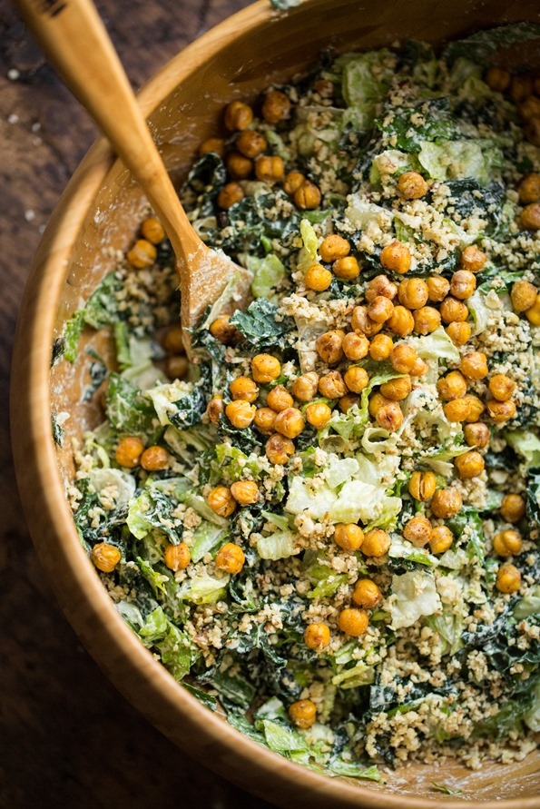

This is a delicious, creamy vegan Caesar salad that will wow any crowd! Everyone who’s tried it goes absolutely nuts over it, and it’s my most popular salad recipe on the blog. To take it over the top, I garnish the salad with a generous amount of crunchy Roasted Chickpea Croutons and a delectable Nut and Seed Parmesan Cheese for the ultimate vegan Caesar salad. The dressing recipe easily doubles for a larger group and it’ll keep in the fridge in a sealed container for a few days so you can make it in advance.

|Prep time|Total time|
--- | ---
|45m|?m|

## Ingredients

### For the roasted chickpea croutons

|Ingredient|Quantity|
--- | ---
chickpeas, drained and rinsed|1 (14 oz./398 mL) can 
extra-virgin olive oil|1 tsp. 
fine grain sea salt|1/2 tsp. 
garlic powder|1/2 tsp. 
cayenne pepper (optional)|1/8 to 1/4 tsp. 

### For the caesar dressing (makes 3/4-1 cup):
|Ingredient|Quantity|
--- | ---
raw cashews, soaked overnight|1/2 cup 
water|1/4 cup 
extra-virgin olive oil|2 Tbsp.
lemon juice|1 Tbsp. 
dijon mustard|1/2 Tbsp.
garlic powder|1/2 tsp. 
garlic |1 small clove (you can add another if you like it super potent)
vegan Worcestershire sauce (I use Wizard's gluten-free brand)|1/2 Tbsp. 
capers|2 tsp. 
fine grain sea salt and pepper|1/2 tsp., or to taste

### For the nut and seed parmesan cheese:

|Ingredient|Quantity|
--- | ---
raw cashews|1/3 cup 
hulled hemp seeds|2 Tbsp. 
garlic|1 small clove
nutritional yeast|1 Tbsp. 
extra-virgin olive oil|1 Tbsp. 
garlic powder|1/2 tsp. 
fine grain sea salt| to taste

### For the lettuce

|Ingredient|Quantity|
--- | ---
lacinato kale, destemmed| 5 cups chopped
romaine lettuce| 10 cups chopped

## Directions

1. Soak cashews in a bowl of water overnight, or for at least a few hours. Drain and rinse.
1. Roast chickpea croutons: Preheat oven to 400°F (200°C). Drain and rinse chickpeas. Place chickpeas in a tea towel and rub dry (it's okay if some skins fall off). Place onto large rimmed baking sheet. Drizzle on oil and roll around to coat. Sprinkle on the garlic powder, salt, and optional cayenne. Toss to coat. Roast for 20 minutes at 400°F (200°C), then gently roll the chickpeas around in the baking sheet. Roast for another 10 to 20 minutes, until lightly golden. They will firm up as they cool.
1. Prepare the dressing: Add the cashews and all other dressing ingredients (except salt) into a high-speed blender, and blend on high until the dressing is super smooth. You can add a splash of water if necessary to get it blending. Add salt to taste and adjust other seasonings, if desired. Set aside.
1. Prepare the Parmesan cheese: Add cashews and garlic into a mini food processor and process until finely chopped. Now add in the rest of the ingredients and pulse until the mixture is combined. Salt to taste.
1. Prepare the lettuce: Destem the kale and then finely chop the leaves. Wash and dry in a salad spinner. Place into extra large bowl. Chop up the romaine into bite-sized pieces. Rinse and then spin dry. Place into bowl along with kale. You should have roughly 5 cups chopped kale and 10 cups chopped romaine.
1. Assemble: Add dressing onto lettuce and toss until fully coated. Season with a pinch of salt and mix again. Now sprinkle on the roasted chickpeas and the Parmesan cheese. Serve immediately.

Source: [ohsheglows.com](https://ohsheglows.com/2014/11/24/crowd-pleasing-vegan-caesar-salad/)
