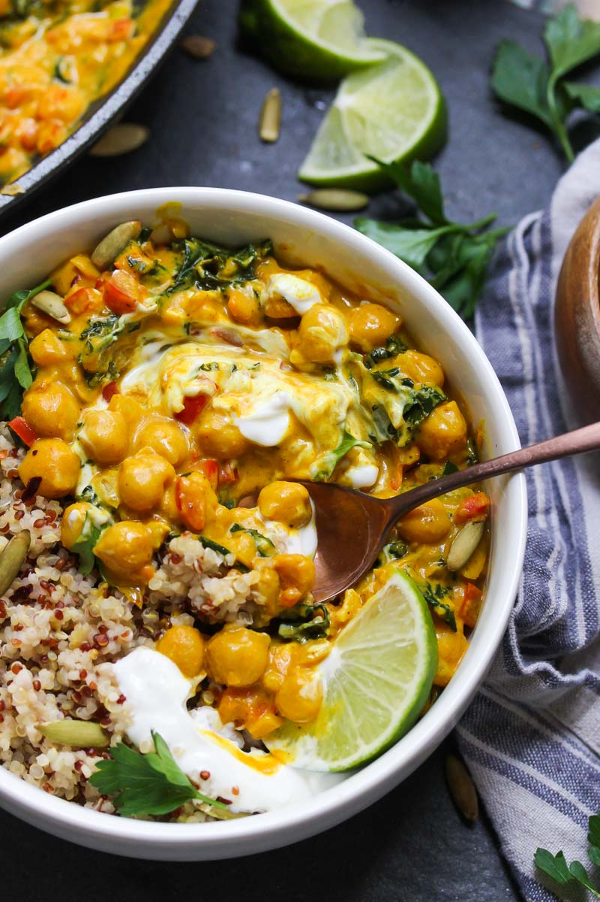

30 Minute Vegan Chickpea Curry with kale and a wealth of aromatics in a full-bodied curry sauce. This healthy weeknight curry is easy to make and perfect for meal prep.

|Prep time|Total time|
--- | ---
|10m|30m|

## Ingredients

|Ingredient|Quantity|
--- | ---
olive oil|1 Tbsp. 
yellow onion diced|1/2 
red bell pepper diced|1
garlic minced|3 cloves 
chopped or roughly torn kale|3 cup
ground turmeric|1 1/2 tsp. 
ground ginger|1 tsp. 
salt|1/2 tsp. 
black pepper|1/4 tsp. 
unsweetened almond cashew, or coconut milk|2 cup 
creamy peanut butter|2 Tbsp. 
red thai curry paste|1 Tbsp. 
chickpeas, drained and rinsed|1 15 oz. can 
Rice noodles, or quinoa for serving

## Directions

1.  Heat oil in a large nonstick skillet over medium heat. Add onion and bell pepper; cook 3 minutes, or until tender. Add garlic and kale; cook until kale is wilted; about 2 minutes. Stir in turmeric, ginger, salt and pepper.
1. Pour in milk and mix in peanut butter and curry paste. Add chickpeas and bring mixture to a simmer; cook 10 to 12 minutes, until sauce slightly thickens.
1. Serve over rice, noodles, or quinoa. Add a dollop of Greek (or coconut) yogurt, a squeeze of fresh lime juice and fresh cilantro, if desired.

Source: [dishingouthealth.com](https://dishingouthealth.com/30-minute-vegan-chickpea-curry/)
