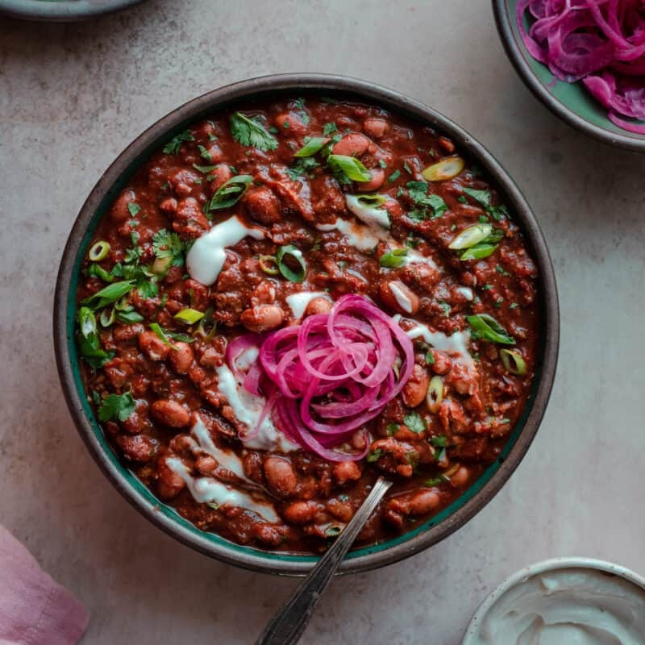

This vegan chili is incredibly rich and velvety and packed with layers of complex flavor, just like a classic chili should be. An easy homemade chili powder and slow simmering take this bean chili over the top. 

|Prep time|Total time|
--- | ---
|20m|1h50m|

## Ingredients

|Ingredient|Quantity|
--- | ---
olive oil | 3 tsp.
yellow onion | 1 large
finely chopped garlic | 6 cloves
japanenos, diced | 2
tomato paste | 2 Tbsp.
chili powder | 4 Tbsp.
ground cumin | 1 Tbsp.
smoked paprika | 1 1/2 tsp.
Mexican oregano (sub. 2 tsp. regular oregano) | 1 tsp.
dry red wine, such as Malbec, Syrah or Pinot Noir | 3/4 cup
vegetable broth | 2 cups
pinto beans | 2 15oz cans
navy beans (or other small white beans) | 1 15oz can
cocoa powder | 2 Tbsp.
bay leaves | 2
Tamari, soy or Worcesteshire sauce | 1 1/2 Tbsp.
chipotle peppers in adobo | 2 peppers, 1Tbsp. sauce
whole peeled tomatoes, include juices | 28oz
kosher salt | 1 1/2 tsp.
black pepper | to taste
maple syrup | 1 Tbsp.
line juice | 1 1/2 Tbsp.
red wine vinegar (sub. apple cider vinegar) | 1 Tbsp.

## Toppings of choice

* Vegan sour cream
* Diced avocado
* Sliced scallions
* Shredded vegan cheese or Vegan Queso
* Quick Pickled Red Onions
	
	1. Very thinly slice 1 medium red onion. Add to a large mason jar. 
	1. Mix together freshly boiled water (3/4 cup or 180 mL) with 1/2 cup (120 mL) apple cider vinegar or distilled white vinegar. Add in 1 tablespoon organic cane sugar or maple syrup, stir until dissolved. 
	1. Pour the hot liquid over the onions. Cool to room temperature, at least 30 minutes. 

## Directions

1. Heat a Dutch oven or heavy-bottomed saucepan over medium-high heat. Add the olive oil, and once it’s shimmering, add the onions and season with a few pinches of salt. Stir frequently and cook the onions until nicely golden brown, stirring occasionally, about 10 minutes. If they start to burn around the edges, stir more frequently and/or add a splash of water.
1. Add the garlic, jalapeños, and tomato paste, and cook for 2-3 minutes, stirring very frequently, until tomato paste is darker in color. If it starts to dry out, add a splash of water and scrape up any browned bits.
1. Stir in the chili powder, cumin, paprika, and oregano and stir vigorously for 30 seconds.
1. Pour in the red wine to deglaze the pot, scraping up any browned bits. Simmer rapidly for 3 to 4 minutes, or until the smell of alcohol has cooked off and it's jammy.
1. Pour in the vegetable broth, pinto beans, navy beans, cocoa powder, bay leaves, soy sauce, chopped chipotle peppers + adobo sauce, hand-crushed tomatoes + their juices, salt, black pepper to taste, and 1 tablespoon maple syrup. Stir well.
1. Bring the chili to a boil over high heat, then reduce to a gentle simmer (this is lowest heat on my small burner). Take care to not boil or too rapidly simmer the chili, as it will break down the beans too much.
1. Cook, stirring every 10 minutes, until thick and velvety and the flavors have melded together, about 1 1/2 hours (or up to 2 hours). Discard the bay leaf.
1. Stir in the masa harina, if using. Simmer for 3 minutes, until the texture has further thickened.
1. Stir in 1 tablespoon lime juice, the vinegar, and cilantro. Taste and add more lime juice as needed for tanginess and add up to 1 more tablespoon maple syrup for sweetness to balance any bitterness. Season with salt and pepper, as needed.
1. Serve with toppings of choice

Source: [rainbowplantlife.com](https://rainbowplantlife.com/vegan-chili/)
