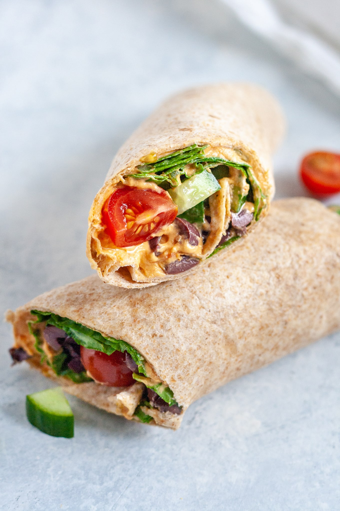

Who remembers eating tortilla roll-ups back in the day? I think the classic combination was something like: flour tortilla, turkey, and cheddar cheese. At least it was in my house. When I was a kid my dad would stick them in the microwave to get them warm and melty before serving them to my sister and I for lunch. These days, my roll-ups are a bit more sophisticated. This Vegan Greek Salad Wrap is my healthy take on a tried and true lunch that’s perfect for work, school, picnics, and everything in between.

|Prep time|Total time|
--- | ---
|10m|10m|

## Ingredients

|Ingredient|Quantity|
--- | ---
whole-wheat tortillas|2, burrito size
regular or red pepper hummus|6 Tbsp. 
baby spinach|3 cup
cucumber, diced|1 cup 
cherry tomatoes, halved|2/3 cup 
kalamata olives, roughly chopped|1/4 cup 
pepperoncini, sliced|1/4 cup 
olive oil|2 tsp. 
salt and black pepper|pinch

## Directions

1. Spread 3 tablespoons of hummus onto one of the tortillas. Layer on half of the spinach and top with cucumber, tomatoes, olives, and pepperoncini, leaving a half-inch of free space towards the top. Drizzle with a teaspoon of olive oil and sprinkle with a pinch of salt and black pepper.
1. Fold in the two sides of the tortilla and, starting at the end closest to you, lift up the bottom edge, tucking it inwards. Begin to roll the tortilla up, tucking and rolling as tightly as possible. When you reach the end, spread another dab of hummus across the top of the tortilla to help it stick before positioning it seam-side down on your cutting board.
1. Use a sharp knife to cut the wrap in half. Repeat with the remaining tortilla to make the second wrap. Enjoy immediately or store in the fridge overnight.

Source: [wellvegan.com](https://wellvegan.com/lunch/vegan-greek-salad-wrap)
