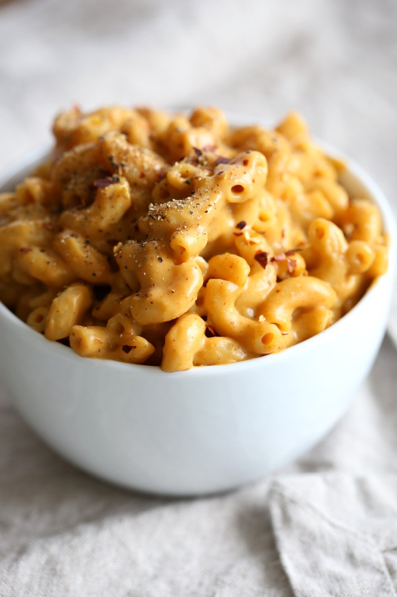

This Easy Vegan Mac and Cheese Powder is perfect to whip up mac and cheese within minutes when needed. 

|Prep time|Total time|
--- | ---
|15m|25m|

## Ingredients

|Ingredient|Quantity|
--- | ---
cashews raw, (see notes for nutfree)|1/2 cup 
nutritional yeast|1/2 cup
flour (all purpose or use oat flour for glutenfree. rice flour will work too, but it adds a slight grittyness)|3 Tbsp. 
tapioca starch or other starch|2 Tbsp. 
garlic powder|2 tsp. 
onion powder|2 tsp. 
ground mustard|1 tsp. 
sugar|1 tsp. 
salt|1.5 tsp. 
paprika, a mix of smoked and regular or all smoked|2 to 3 tsp. 
black pepper|1/2 to 1 tsp. 

### To make Mac & Cheese
|Ingredient|Quantity|
--- | ---
mac or other small pasta|1 cup 
non dairy milk or water|1 cup 
mac and cheese powder from above|1/3 to 1/2 cup
olive oil or vegan butter (optional)|2-3 tsp.

## Directions

### To make the Powder Mix:
1. Process everything in a food processor or blender until powdered. It takes 2-3 mins. Blend/process or a minute, scrape sides and blend again. (Check in between to feel the mixture if it is too gritty with pieces of nuts. Process more until the mixture becomes more powdery with just a slight grittyness.) 
1. Add other flavor profiles such as chipotle, cajun, garam masala and mix in (optional). See notes for options.

### To make mac:
1. Cook 1 cup of dry pasta according to instructions on the package in salted water. Drain and set aside.
1. Combine 1/3 to 1/2 cup of mix with 1 cup of water or non dairy milk and 2-3 tsp olive oil or vegan butter (optional) in a saucepan or blend and add to saucepan for creamier, and bring to a boil. Add cooked pasta (and optionally sauteed veggies such as mushrooms, broccoli etc) and cook for a min, taste and adjust salt and flavor. (You can add 1 tsp miso or soy sauce and/or lemon juice for additional flavor. Garnish with oregano, pepper flakes if needed.) Cover and let sit for another 2 mins. (For saucier, use 1/2 cup mix. You can add a tbsp more of the powder to the simmering sauce, if it isnt as thick as you like).
1. **To make cheese sauce** to drizzle over roasted veggies or salad or baked potato, blend 1/2 cup mix with 1 cup non dairy milk.Add to a pan and bring to a boil. Simmer for a few mins to thicken. 
1. **To Store**: Store in a glass jar or ceramic airtight container. On the counter away from heat for upto a month. Refrigerate for freshness and longer life. 

## Notes
 - **Chipotle Mac**: Add 1 tsp chipotle pepper powder, 1 tsp smoked paprika and 1 tsp oregano. 
 - **Cajun/garam masala/Jerk Mac**: Add 1 Tbsp cajun spice/garam masala/jerk seasoning to the mix. Sprinkle more on the cooked mac . 

Source: [veganricha.com](https://www.veganricha.com/vegan-mac-and-cheese-powder/)
