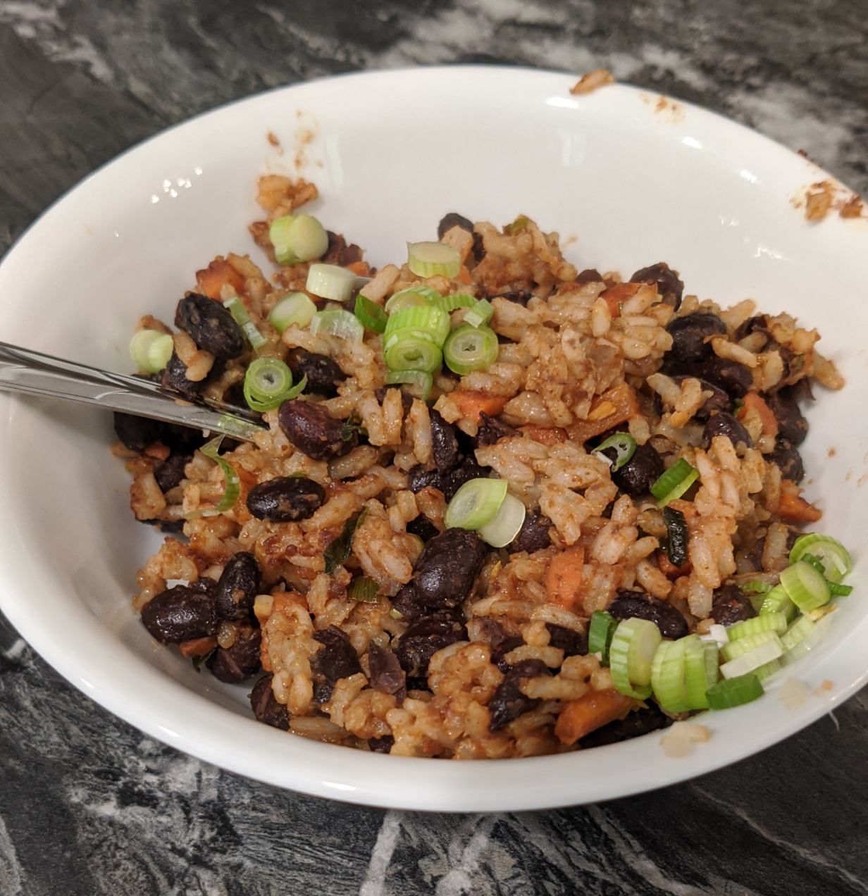

Rice boiled vegetable broth with beans, carrots, green onions, and diced garlic. Fried with chili powder, cumin, and hot chili oil.

|Prep time|Total time|
--- | ---
|20m|35m|

## Ingredients

|Ingredient|Quantity|
--- | ---
vegetable broth | 2 cups
long-grain rice | 1 cup
olive oil, divided | 2 Tbsp.
onion, finely diced | 1 medium
garlic cloves, minced | 2 large 
carrots, chopped | 1 cup
black beans, drained and rinsed | 2 15 oz. cans
onion powder | 1 tsp.
cumin powder | 1 tsp.
chili powder | 1 tsp.
sea salt | 1 tsp.
hot chili oil | 1 tsp.
lime juice | 1/2 tbsp. 
black pepper, or to taste | 1/4 tsp. 
chopped cilantro or parsley | 1/4 cup

## Directions

1. In a medium pot, bring the vegetable stock to a boil. Add rice and about 1 Tbsp. of oil. Reduce heat to low, and simmer for 20 minutes, until the rice is cooked through and fluffy.
1. In the meantime, heat up a large skillet over medium heat, add the other tablespoon of olive oil, green onion, onion powder, and cook for about 5 minutes.
1. Add the carrots and garlic. Cook for another 3-5 minutes.
1. Add the cumin, chili powder, hot chili oil, salt, and pepper. Stir, and cook for 1 minute, until the spices are fragrant.
1. Add in the beans and cook until just heated through.
1. Add the cooked rice and lime juice. Stir, turn off the heat, and serve. Top with chopped green onion.

Source: 
