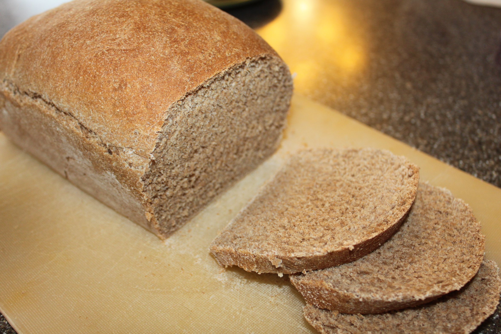

|Prep time|Total time|
--- | ---
|5m|3.5h|

## Ingredients

|Ingredient|Quantity|
--- | ---
water | 1 5/8 cups
brown sugar | 1/3 cup packed
salt | 2 tsp.
whole wheat flour | 4 2/3 cups
active dry yeast | 3 tsp.

## Directions

1. Place ingredients in the pan of the bread machine in the order recommended by the manufacturer.
1. Select wheat bread cycle, 2 pound; press Start.

Source: 
